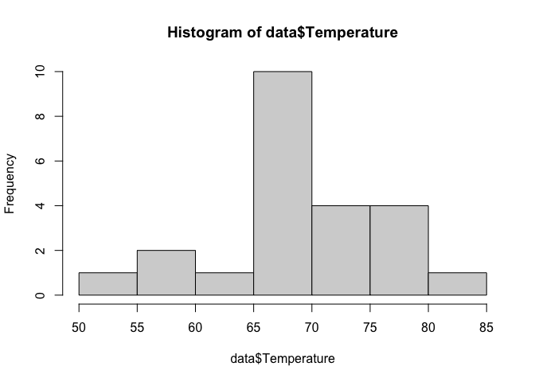
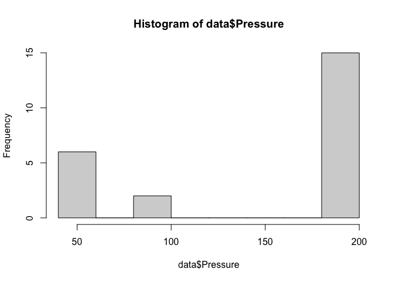
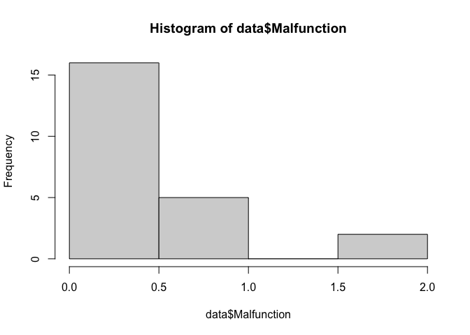
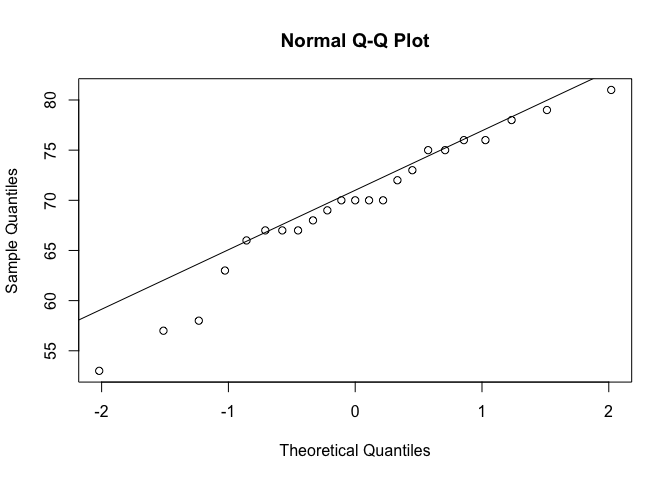
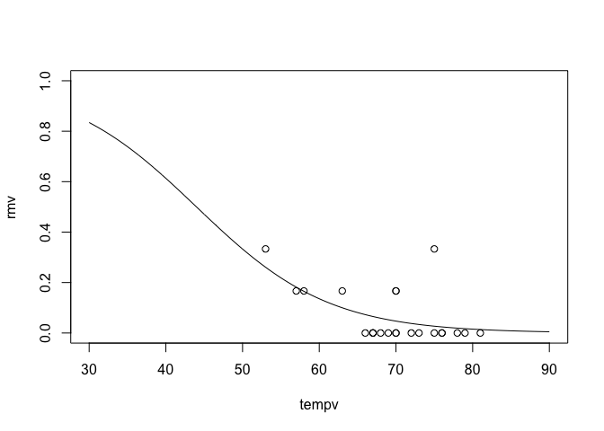

Challenger shuttle report
================
Ruxandra Iliescu
2026-10-05

# Summary

One of the mistakes that I spotted in the analysis performed on the
Challenger is that the observations corresponding to Malfunction=0 were
removed. By looking at the logistic model fitted using the entire
dataset, we can see that there could be an inverse proportional
relationship between temperature and the probability of malfunction
(i.e., as temperature decreases, the probability of malfunction
increases).

# Small analysis

``` r
data = read.csv("module2_exo5_shuttle.csv",header=T)
hist(data$Temperature)
```

<!-- -->

``` r
hist(data$Pressure)
```

<!-- -->

``` r
hist(data$Malfunction)
```

<!-- -->

``` r
qqnorm(data$Temperature)
qqline(data$Temperature)
```

<!-- -->

``` r
logistic_reg = glm(data=data, Malfunction/Count ~ Temperature, weights=Count, 
                   family=binomial(link='logit'))
summary(logistic_reg)
```

    ## 
    ## Call:
    ## glm(formula = Malfunction/Count ~ Temperature, family = binomial(link = "logit"), 
    ##     data = data, weights = Count)
    ## 
    ## Coefficients:
    ##             Estimate Std. Error z value Pr(>|z|)  
    ## (Intercept)  5.08498    3.05247   1.666   0.0957 .
    ## Temperature -0.11560    0.04702  -2.458   0.0140 *
    ## ---
    ## Signif. codes:  0 '***' 0.001 '**' 0.01 '*' 0.05 '.' 0.1 ' ' 1
    ## 
    ## (Dispersion parameter for binomial family taken to be 1)
    ## 
    ##     Null deviance: 24.230  on 22  degrees of freedom
    ## Residual deviance: 18.086  on 21  degrees of freedom
    ## AIC: 35.647
    ## 
    ## Number of Fisher Scoring iterations: 5

``` r
# shuttle=shuttle[shuttle$r!=0,] 
tempv = seq(from=30, to=90, by = .5)
rmv <- predict(logistic_reg,list(Temperature=tempv),type="response")
plot(tempv,rmv,type="l",ylim=c(0,1))
points(data=data, Malfunction/Count ~ Temperature)
```

<!-- -->
